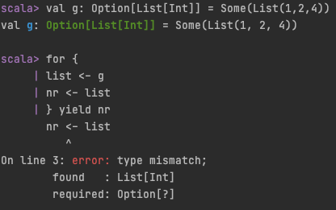

# scala-cats-study

Documentation for Rock the JVM's Scala Cats course.

Type class pattern. 3 steps:
1. Type class
2. Type class instance
3. Type class API
4. (option) Type class extension method

Equivalents in cats imports:
1. import cats.TypeClass
2. import cats.instances.yourType._
3. ^ with the above
4. import cats.syntax.yourTypeClass._

# Summary

While object oriented programming relies on subtype polymorphism in functional programming
we rely more on parametric polymorphism. This is what type classes really give us. 

Cats library relies heavily on type classes and offers many out-of-the box implementations for the most common
<b>concepts</b> such as monad, monoid etc. 
I say "concept" because monad, monoid, functor etc. are just abstractions. They don't exist on their own.
They only give us a framework like "what does a type need to provide/do to call itself a monad". 
Think about a familiar concept close to humans, like "friendship". 
You can't touch it or point at it, but you can describe what it should entail, e.g. supporting another person.

<b>Higher kinded type (HKT)</b> means the type parameter takes a type itself. So e.g. `Type[AnotherType[T]]`
is a higher kinded type because `AnotherType` needs a type itself.
`Type[Something]` is not a higher kinded type then.

## Semigroup concept (not a HKT)
Combine elements of the same type. E.g. `reduce` needs a Semigroup. Extension method from semigroup - |+| read: "combine"

e.g. below "combine" requires `Semigroup[Expense]` present:
```
Expense(1, 53.2) |+| Expense(5, 23.2) 
```

## Monoid concept (not a HKT)
Combine elements just like Semigroup BUT provides a "zero" value too. E.g. `fold` needs a Monoid, because it needs to combine types and also needs a "zero" value.

e.g. if we were to use this generic method below for a type `ShoppingCart` we would need to have `Monoid[ShoppingCart]` present:
```
def combineFold[T](list: List[T])(implicit monoid: Monoid[T]): T = {
    list.foldLeft(monoid.empty)(_ |+| _)
}
```

## Functor concept (HKT)
A HKT type class that generalises idea of `.map`. It provides `.map` for a given type.

`Functor[Tree[T]]`

e.g. if we had a type `Tree[T]` and wanted to have a `.map` for it we would need to have
a `Functor[Tree]` which overrides Functor's `.map` and "explains" how to `.map` on a `Tree[T]`

## Monad concept (HKT)
A HKT type class that generalises the idea of `.flatMap` also called `bind`. 
It also provides `.pure` which just wraps a value in a monad. Using `flatMap` and `pure` we can also create
`map` so every Monad is a `Functor`. Every Monad is also an `Applicative` (because of `pure`)

<b>Monad is a way of representing chained, sequential transformations.</b>

`Monad[T]` == (e.g. `Future[Int]`, `Option[String]`, `List[Char]`). Example monads in Scala: `Future`, `Try`, `List`, `Option`, `Map`, `Either`.

Monads DO NOT compose. That means you cannot do a sequence of flatmaps for <b>nested</b> monads to get to the "bottom" type, .e.g `Option[List[Int]]`:


## Monad Transformers concept (HKT)
<b>They are NOT monads!</b> Convenience wrapper around nested monad that allows for their combining. Transformers have a word `T` at the end, e.g. `OptionT` or `EitherT`.

The way monad transformers work is to help you on working with a "inner" monad that is being "transformed" by a "outer" monad. So `F[Option[A]]` can be turned into a `OptionT[F, A]` (where F is any monad), which is much easier to work with.

Awesome blog post [here](https://blog.buildo.io/monad-transformers-for-the-working-programmer-aa7e981190e7).
Awesome image of a cats transformer [here](https://miro.medium.com/max/1000/1*Tb2VjzXOJiXImWZymmDCfQ.jpeg) (just had to save it...)


## Example monads
- Eval: Eval.now, Eval.later, Eval.always
- Reader: dependency injection
- Writer: keep track while data is being processed
- State: handle state in a functional way. Immutable handling of expressions like "var a = 3; a * 5; a + 2"

## Example non-monads 
- Validated: data structure that encapsulates data, its validation and errors. Very suitable for collecting error reasons like in a form validation


